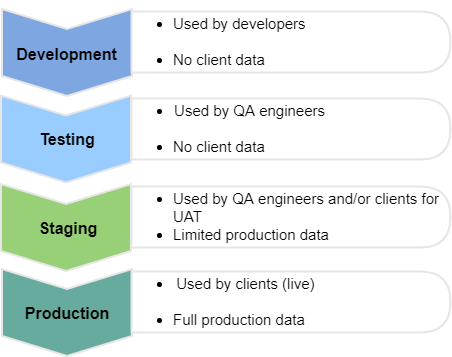

#### [Software Development](../README.md) > Environments

# Environments 

1. [Development](environments-development.md)
2. Testing
3. Staging
4. Production

<figure>
	
	<figcaption align = "left">
		https://oroinc.com/b2b-ecommerce/blog/testing-and-staging-environments-in-ecommerce-implementation/
	</figcaption>
</figure>

