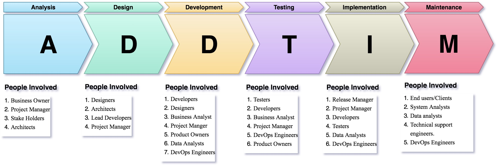

### [SDLC](../README.md) > Phases

# Phases

<figure>
	
	<figcaption align="left">
		https://www.devopsdiggers.com/wp-content/uploads/2020/04/final.jpg
	</figcatpion>
</figure>

### Different Phases
1. Requirement Analysis
2. Planning
2. Architectural Design
3. Development
4. Testing
5. Deployment
6. Review
7. Maintain