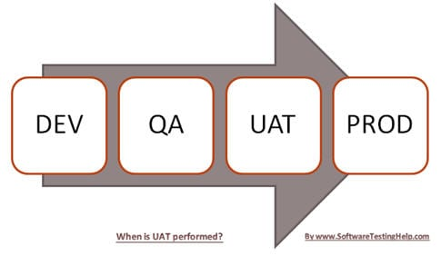

### [Testing](./testing.md) > UAT

# User Acceptance Testing

"User acceptance testing (UAT) consists of a process of verifying that a solution works for the user." [1]

### Basics
- done in the final stages of the testing process
- may also be called "Beta testing" or "end-user testing"
- should preferably be performed by a subject-matter-expert (SME)
- done in a "Staging Environment" before being pushed to Production

<figure>
	
	<figcaption align="left">
		https://www.softwaretestinghelp.com/what-is-user-acceptance-testing-uat/
	</figcaption>
</figure>

"It is important that the materials given to the tester be similar to the materials that the end user will have. Testers should be given real-life scenarios such as the three most common or difficult tasks that the users they represent will undertake." [[1]]

### UAT vs QA
"Quality assurance testing ensures that the software performs just according to the parameters that are set out by the software developers." [[2]]

### Importance of UAT
"After performing loads of system, integration and regression testing one would wonder about the necessity of this testing. Actually speaking, this is the most important phase of the project as this is the time at which the users who are actually going to use the system would validate the system for its fit to purpose." [[3]]

"UAT is a test phase that largely depends on the perspective of the end-users and the domain knowledge of a department that represents the end-users." [[3]]

"Developers and functional testers are technical people who validate the software against functional specifications. They interpret the requirements according to their knowledge and develop/test the software (here is the importance of domain knowledge).

The sofware is complete according to the functional specifications but there are some business requirements and processes that are known only to the end-users are either missed to communicate or misinterpreted." [[3]]

### Resources
- [What Is UAT Testing?](https://www.panaya.com/blog/testing/what-is-uat-testing/)

[1]: https://en.m.wikipedia.org/wiki/Acceptance_testing#User_acceptance_testing
[2]: https://performancelabus.com/qa-vs-uat-testing/
[3]: https://www.softwaretestinghelp.com/what-is-user-acceptance-testing-uat/
